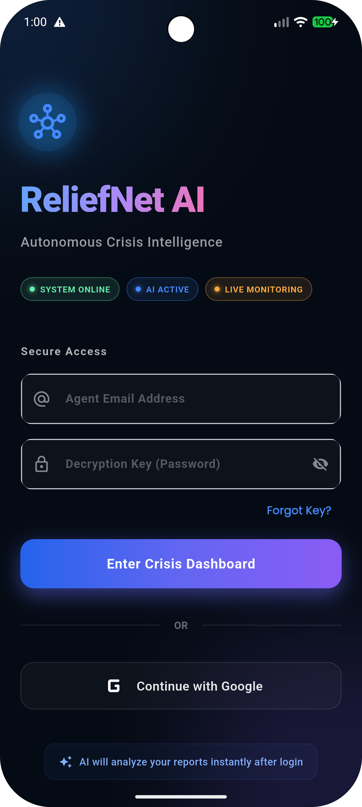
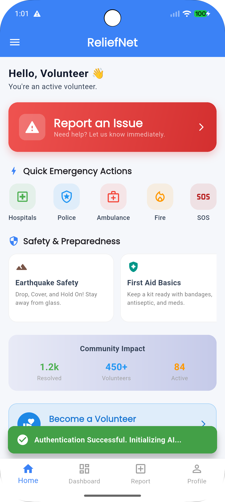
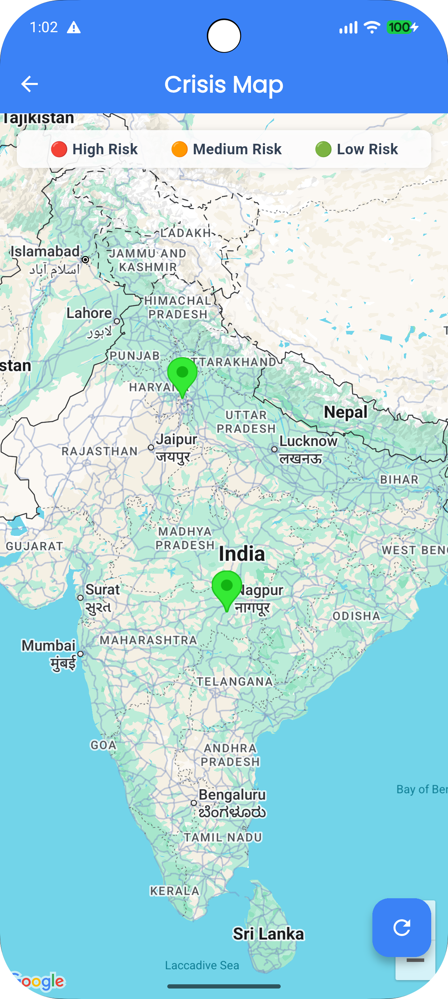
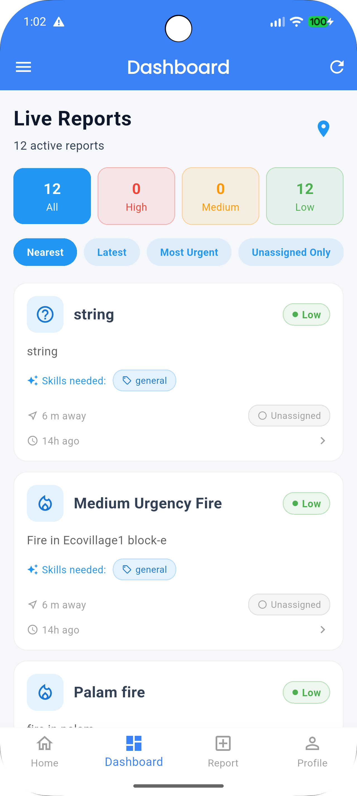
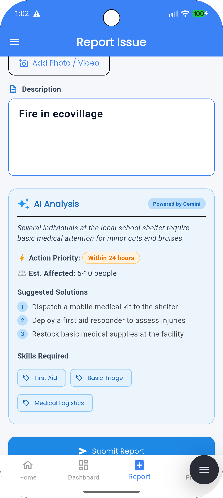
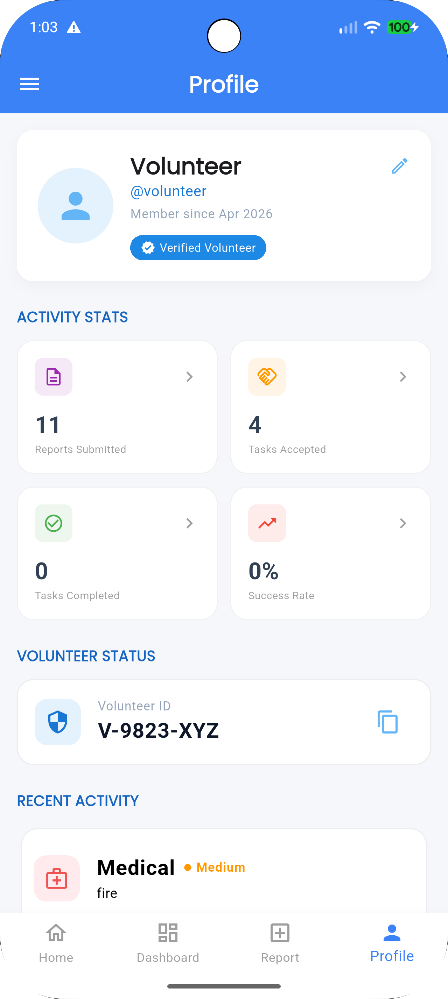
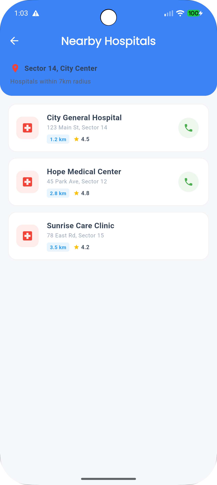
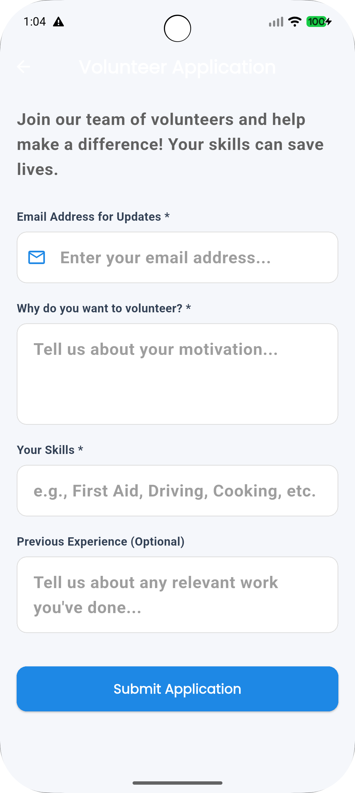

# 🌍 ReliefNet AI
**Autonomous Crisis Intelligence Network**

> *Transforming disaster response from reactive to predictive and intelligent.*

---

## 🚨 The Problem
When disaster strikes, every second counts. Current emergency response systems suffer from fragmented data, unstructured reports, and slow resource allocation. First responders are overwhelmed, lacking real-time, actionable intelligence to deploy volunteers and aid where they are needed most.

## 💡 The Solution
**ReliefNet AI** is an autonomous, end-to-end disaster response platform powered by Artificial Intelligence. It parses chaotic crisis data in real-time, predicts emerging high-risk zones, and mathematically matches the closest, most capable volunteers to the front lines. 

---

## ✨ Key Features
- **Intelligent Dispatch:** Autonomous parsing of on-the-ground crisis reports into structured logistical metadata.
- **Volunteer Matching Engine:** Rapid assignments using geospatial proximity algorithms and specialized skill-scoring.
- **Predictive Risk Modeling:** Forecasts disaster severity using environmental metrics to proactively alert regions.
- **Interactive Triage Map:** A live, dynamic Google Maps overlay that automatically highlights and animates severe danger zones to command centers.
- **Cross-Platform Mobile Client:** Flutter-powered dashboard for field-agents to rapidly report incidents and analyze AI predictions.

---

## 🧠 AI Capabilities
ReliefNet AI pushes machine learning to the forefront of crisis management:
* **Natural Language Processing (NLP) Analyzer:** Instantly extracts the crisis type, absolute urgency level, and precise humanitarian needs (water, medical, food) from unstructured text inputs.
* **Predictive ML Engine:** Ingests dynamic environmental data (rainfall, topography, population density, historical patterns) to synthesize an explainable, normalized 0.0-1.0 risk score.
* **Explainable AI (XAI):** Doesn't just predict—it explains. Provides command teams with a human-readable array of isolated risk factors (e.g., "heavy rainfall", "high population density") so leaders can trust the data.

---

## 🏗 System Architecture

```text
[ Field Volunteers / Users ]
           │
           ▼
[ Flutter Mobile App ] ─── (Real-time tracking & reports)
           │
           ▼
[ FastAPI Backend Engine ] 
           │
   ┌───────┼──────────────────────────────┐
   ▼       ▼                              ▼
 [ NLP ]  [ Predictor ]          [ Volunteer Matcher ]
   │       │                              │
   └───────┼──────────────────────────────┘
           ▼
[ Firebase Firestore ] ─── (Real-time NoSQL DB)
```

---

## 💻 Tech Stack
- **Frontend:** Flutter, Dart, Google Maps Platform
- **Backend:** Python, FastAPI, Uvicorn
- **Database:** Firebase Firestore (Real-time)
- **AI/ML:** Custom heuristics, structured for Google Vertex AI / Gemini integration
- **DevOps:** Docker architecture, designed for Google Cloud Run deployment

---

## 📸 Screenshots

<p align="center">
  
  
  
  
</p>
<p align="center">
  
  
  
  
</p>

---

## 🎥 Live Demo

Check out the full application walk-through and features in action:
[](https://youtu.be/FYYJjwomQWI)

---

## 📊 Project Presentation

Dive deeper into our architecture, business model, and vision:

[](https://canva.link/rbxiy25rj6q77gr)

> Or view the simple markdown link: [ReliefNet AI Pitch Deck (Canva)](https://canva.link/rbxiy25rj6q77gr)

---

## ⚙️ Installation Guide

### Backend Setup (FastAPI)
1. Clone the repository and navigate to the backend directory:
   ```bash
   cd backend
   ```
2. Activate a virtual environment and install requirements:
   ```bash
   source venv/bin/activate
   pip install -r requirements.txt
   ```
3. Inject your Firebase Admin credentials:
   - Place your `firebase-adminsdk.json` in the `backend/` root directory.
4. Launch the API:
   ```bash
   uvicorn main:app --host 0.0.0.0 --port 8000 --reload
   ```

### Frontend Setup (Flutter)
1. Navigate to the mobile application directory:
   ```bash
   cd frontend/mobile_app
   ```
2. Ensure you have injected your Google Maps SDK API Key in `android/app/src/main/AndroidManifest.xml`.
3. Fetch dependencies and run:
   ```bash
   flutter pub get
   flutter run
   ```

---

## 🔌 API Endpoints
- `POST /api/crisis/report` - Ingests a raw crisis report, runs the NLP Analyzer, and matches volunteers.
- `GET /api/crisis` - Retrieves all structured crisis events.
- `POST /api/predict` - Submits region telemetry and returns an explainable AI risk prediction.
- `GET /api/volunteer` - Fetches the roster of available humanitarian responders.

---

## 🚀 Future Scope
- **Satellite Vision AI:** Integrating satellite imagery to autonomously detect floods and fires before human reports are filed.
- **Gemini Multimodal:** Allowing users to upload photos of structural damage to instantly evaluate reconstruction costs and medical severity.
- **Offline Mesh Networking:** Allowing the mobile application to relay crisis data between phones when cell towers collapse.

---

## 📈 Impact
By cutting the triage time from hours to seconds, ReliefNet AI ensures that resources are allocated mathematically rather than reactively, minimizing casualties, optimizing human deployment, and saving lives in the critical golden hour of a disaster.

---

## 🤝 Contributors
* Built with dedication by the ReliefNet AI Team. 

## 📄 License
This project is licensed under the MIT License.
